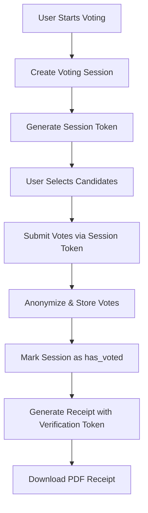
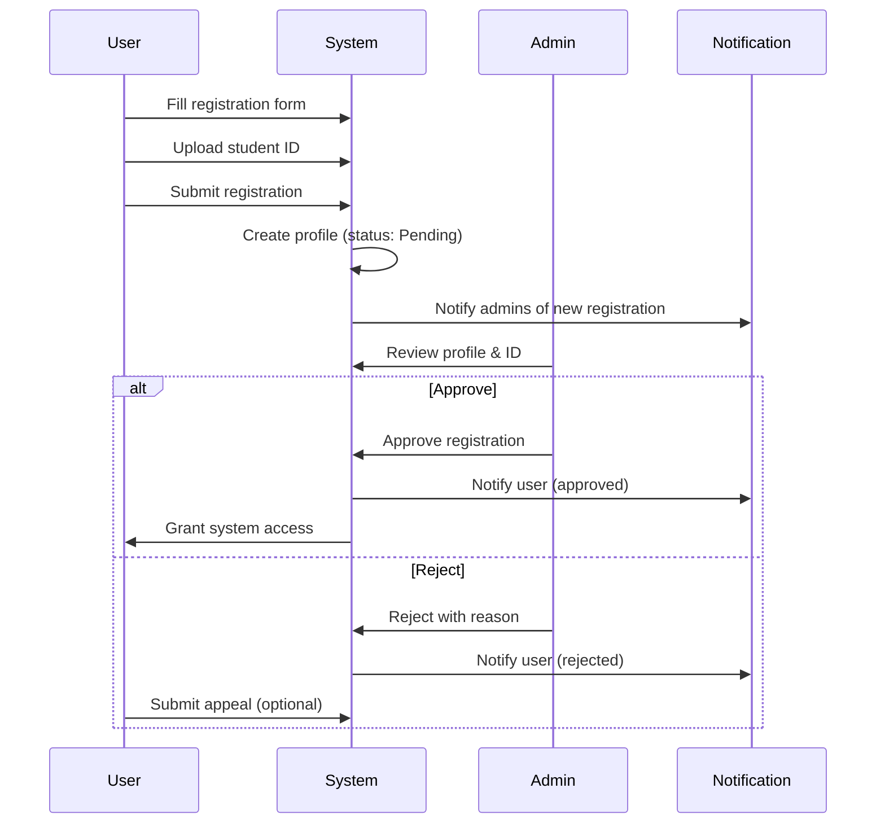
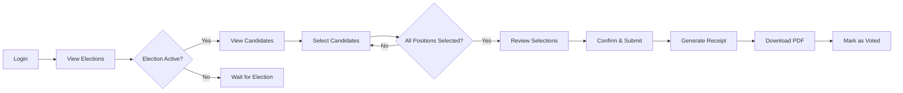

# **EVOTAR: COMPREHENSIVE CAPSTONE PROJECT DOCUMENTATION**
## **Digital Voting Platform for Saint Joseph College of Sindangan, Inc.**

---

## **📋 EXECUTIVE SUMMARY**

**Project Name:** Evotar (An Online Voting Web-Based System for Saint Joseph College of Sindangan Incorporated (SJCSI))  
**Institution:** Saint Joseph College of Sindangan, Inc. (SJCSI)  
**Project Type:** Web-Based Digital Voting System  
**Technology Stack:** React, TypeScript, Supabase, Vite  
**Deployment:** Progressive Web Application (PWA)  
**Domain:** https://www.evotar.xyz

---

## **🎯 PROJECT OVERVIEW**

### **Project Vision**
Evotar is a secure, transparent, and accessible digital voting platform designed exclusively for SJCSI student elections. The system democratizes the election process by providing a modern, mobile-friendly interface that maintains complete voter anonymity while ensuring election integrity through comprehensive audit trails.

### **Problem Statement**
Traditional paper-based voting systems face challenges including:
- Manual vote counting leading to delays
- Limited accessibility for remote or mobile voters
- Difficulty in maintaining transparency
- High administrative overhead
- Risk of vote manipulation or loss
- No verifiable receipt system

### **Solution**
Evotar provides a full-stack digital voting platform that addresses these challenges through:
- **Real-time vote counting** with instant result tabulation
- **Mobile-responsive design** accessible from any device
- **Anonymous voting sessions** ensuring complete privacy
- **Role-based access control** for Voters, Staff, and Administrators
- **Audit logging** for all system activities
- **PDF receipt generation** with QR code verification
- **Comprehensive analytics** with demographic breakdowns

---

## **🏗️ SYSTEM ARCHITECTURE**

### **Technology Stack**

#### **Frontend Technologies**
- **React 18.3.1**: Modern UI library with hooks
- **TypeScript 5.5.3**: Type-safe development
- **Vite 5.4.1**: Fast build tool and dev server
- **TailwindCSS 3.4.11**: Utility-first CSS framework
- **Radix UI**: Accessible component primitives
- **shadcn/ui**: Pre-built component library
- **React Router DOM 6.26.2**: Client-side routing
- **TanStack Query 5.56.2**: Server state management
- **React Hook Form 7.53.0**: Form management
- **Zod 3.23.8**: Schema validation

#### **Backend & Database**
- **Supabase**: Backend-as-a-Service platform
  - PostgreSQL database with RLS (Row Level Security)
  - Authentication service with session management
  - Storage buckets for images (student-ids, candidate-profiles, election-covers)
  - Real-time subscriptions
  - Edge Functions for serverless logic

#### **Additional Libraries**
- **jsPDF 3.0.1**: PDF receipt generation
- **QRCode 1.5.4**: QR code generation for verification
- **Lucide React 0.462.0**: Icon library
- **Recharts 3.1.2**: Data visualization
- **next-themes 0.4.6**: Dark/light mode support
- **OTPAuth 9.4.0**: Two-factor authentication

---

## **💾 DATABASE SCHEMA**

### **Core Tables**

#### **1. profiles** (User Management)
```sql
- id: uuid (primary key)
- user_id: uuid (references auth.users)
- student_id: text (unique identifier)
- full_name: text
- email: text
- registration_status: text (Pending, Approved, Rejected)
- course: text
- year_level: text
- gender: text
- id_image_url: text (secure storage path)
- role: user_role enum (Voter, Staff, Administrator)
- two_factor_enabled: boolean
- two_factor_secret: text
- two_factor_recovery_codes: text[]
```

#### **2. elections** (Election Management)
```sql
- id: uuid (primary key)
- title: text
- description: text
- election_type: text
- start_date: timestamptz
- end_date: timestamptz
- status: text (Upcoming, Active, Completed)
- eligible_voters: text (All Courses or specific course)
- cover_image_url: text
- show_results_to_voters: boolean
```

#### **3. positions** (Election Positions)
```sql
- id: uuid (primary key)
- election_id: uuid (foreign key)
- title: text (President, Vice President, Representatives, etc.)
- description: text
- max_candidates: integer (default 10)
```

#### **4. candidates** (Candidate Information)
```sql
- id: uuid (primary key)
- election_id: uuid
- position_id: uuid
- full_name: text
- bio: text
- partylist: text
- image_url: text
- jhs_school, shs_school: text (educational background)
- jhs_graduation_year, shs_graduation_year: integer
- why_vote_me: text
```

#### **5. voting_sessions** (Anonymous Voting)
```sql
- id: uuid (primary key)
- voter_id: uuid
- election_id: uuid
- session_token: text (unique, secure)
- has_voted: boolean
- expires_at: timestamptz (24-hour validity)
```

#### **6. votes** (Anonymized Votes)
```sql
- id: uuid (primary key)
- voter_id: uuid (for eligibility tracking only)
- election_id: uuid
- position_id: uuid
- candidate_id: uuid
- created_at: timestamptz
```

#### **7. vote_receipts** (Verification System)
```sql
- receipt_id: text (primary key, unique identifier)
- election_id: uuid
- election_title: text
- selected_candidates: jsonb
- receipt_hash: text
- verification_token: text (unique)
- voting_date: timestamptz
```

#### **8. audit_logs** (Security & Compliance)
```sql
- id: uuid (primary key)
- actor_id: uuid (nullable for anonymous voting)
- actor_role: user_role
- action: text (login, logout, vote, approve, etc.)
- resource_type: text (user, election, vote, etc.)
- resource_id: uuid
- ip_address: inet
- user_agent: text
- details: jsonb
- timestamp: timestamptz
```

#### **9. notifications** (Communication System)
```sql
- id: uuid (primary key)
- title: text
- message: text
- type: text (election_active, results_published, etc.)
- priority: text (low, medium, high)
- recipient_user_id: uuid (nullable)
- target_roles: user_role[]
- data: jsonb
- link_url: text
- read_at: timestamptz
- created_by: uuid
```

#### **10. pending_actions** (Staff Workflow)
```sql
- id: uuid (primary key)
- action_type: text (create_election, add_candidate, publish_results)
- action_data: jsonb
- requested_by: uuid
- status: text (Pending, Approved, Rejected)
- reviewed_by: uuid
- admin_notes: text
```

#### **11. profile_update_requests** (User Updates)
```sql
- id: uuid (primary key)
- user_id: uuid
- current_email, requested_email: text
- current_year_level, requested_year_level: text
- status: text (Pending, Approved, Rejected)
- admin_notes: text
- reviewed_by: uuid
```

#### **12. user_roles** (Role Management - Security Critical)
```sql
- id: uuid (primary key)
- user_id: uuid
- role: user_role enum
```

---

## **🔐 SECURITY ARCHITECTURE**

### **Authentication & Authorization**

#### **1. Multi-Factor Authentication (2FA)**
- Time-based One-Time Passwords (TOTP)
- QR code setup with authenticator apps
- Recovery codes for account access
- Step-up verification for sensitive actions

#### **2. Row Level Security (RLS)**
Every database table has comprehensive RLS policies:

**Example: Profiles Table**
```sql
-- Voters can view own profile
-- Staff can view all voter profiles
-- Admins can view and update all profiles
```

**Example: Votes Table**
```sql
-- Users can insert only their own votes
-- Users can view only their own voting history
-- NO user can update or delete votes (immutable)
```

#### **3. Role-Based Access Control (RBAC)**

| Feature | Voter | Staff | Administrator |
|---------|-------|-------|---------------|
| Vote in elections | ✅ | ❌ | ❌ |
| View candidates | ✅ | ✅ | ✅ |
| View results (published) | ✅ | ✅ | ✅ |
| Manage elections | ❌ | ✅ | ✅ |
| Add candidates | ❌ | ✅ | ✅ |
| Approve users | ❌ | ❌ | ✅ |
| View audit logs | Own | Limited | All |
| Publish results | ❌ | Request | ✅ |
| Manage roles | ❌ | ❌ | ✅ |

#### **4. Anonymous Voting System**


**Key Security Features:**
- Session tokens are cryptographically random (64 characters)
- Votes are immediately separated from voter identity
- Session tokens expire after 24 hours
- One voting session per election per voter
- Votes are immutable (cannot be updated or deleted)

#### **5. Secure Image Storage**
- Private storage buckets (not publicly accessible)
- Signed URLs with time-limited access (1 hour)
- RLS policies on storage buckets
- Secure image upload with validation

---

## **📱 USER INTERFACES**

### **1. Landing Page** (`/`)
- Hero section with gradient background
- Feature highlights (Secure, Transparent, Accessible, Verified)
- Call-to-action: "Access Voting Portal"
- Footer navigation (About, FAQ, Privacy, Terms)

### **2. Authentication Pages**

#### **Login** (`/login`)
- Student ID or Email authentication
- Password input with show/hide toggle
- "Forgot Password" link
- Two-factor authentication support
- Responsive mobile design

#### **Sign Up** (`/login` - Multi-step form)
**Step 1: Student Information**
- Student ID
- Full name
- Email
- Password & confirmation
- Course & Year level
- Gender

**Step 2: ID Verification**
- Upload student ID image
- Preview before submission
- File validation (image types, size)

**Step 3: Confirmation**
- Review submitted information
- Create account button
- Email verification requirement

#### **Reset Password** (`/reset-password`)
- Email input
- Password reset link sent via email
- New password creation
- Confirmation page

### **3. Dashboard** (`/dashboard`)

**Mobile-First Design:**
- Bottom navigation bar (5 tabs)
- Sticky header with notifications
- Collapsible sidebar (desktop)
- Role-specific content

**Voter Dashboard Tabs:**
1. **Home**: Overview with active elections, voting status
2. **Elections**: List of available elections with status badges
3. **Candidates**: Browse candidates by election and position
4. **Results**: View published election results
5. **Settings**: Profile, security settings, 2FA setup

**Staff Dashboard Additional Features:**
- Staff Panel for pending actions
- Election management (create, edit, delete)
- Candidate management
- Analytics dashboard

**Admin Dashboard Additional Features:**
- Admin Panel for user management
- Pending approvals (user registrations)
- Role management
- Audit logs viewer
- Election results publication control

### **4. Voting Interface**
```
┌─────────────────────────────────────┐
│ Cast Your Vote: [Election Title]    │
│ Select candidates for each position │
├─────────────────────────────────────┤
│ [Position 1]                        │
│ ┌───────┐ ┌───────┐ ┌───────┐       │
│ │Cand 1 │ │Cand 2 │ │Cand 3 │       │
│ │ ☐ ✓  │ │  ☐   │ │  ☐    │       │
│ └───────┘ └───────┘ └───────┘       │
├─────────────────────────────────────┤
│ [Position 2]                        │
│ (Representative - Select up to 2)   │
│ ┌───────┐ ┌───────┐                 │
│ │Cand 1 │ │Cand 2 │                 │
│ │ ☑ ✓  │ │ ☑ ✓  │                 │
│ └───────┘ └───────┘                 │
├─────────────────────────────────────┤
│        [ Submit My Votes ]          │
└─────────────────────────────────────┘
```

**Features:**
- Visual candidate cards with photos
- Single selection for most positions
- Multiple selection (up to 2) for representatives
- Year-level filtering (only eligible positions shown)
- Confirmation dialog before final submission
- Automatic PDF receipt download

### **5. Results Page**
**Published Results Display:**
- Election dropdown selector
- Position-based grouping
- Candidate vote counts
- Visual bar charts
- Winner badges
- Analytics dashboard (Admin/Staff only)
  - Voting participation by course and gender
  - Turnout percentages
  - Position-specific analytics

### **6. Administrative Interfaces**

#### **User Management**
- User list with filters (All, Pending, Approved, Rejected)
- Search by name, email, or student ID
- User details dialog with full information
- Approve/Reject actions with admin notes
- Role change functionality
- Resubmit for rejected users

#### **Election Management**
- Create election form with:
  - Title, description, type
  - Start/end dates
  - Eligible voters (All or specific course)
  - Cover image upload
  - Position creation with max candidates
- Edit existing elections
- Delete elections (with confirmation)
- Toggle results visibility

#### **Candidate Management**
- Add candidate form with:
  - Full name, bio
  - Partylist affiliation
  - Educational background
  - "Why vote for me" statement
  - Profile photo upload
- Edit candidate information
- Delete candidates

#### **Audit Logs**
- Comprehensive activity timeline
- Filter by user, action type, date range
- Detailed event information
- IP address and user agent tracking
- Export functionality

---

## **🔄 KEY WORKFLOWS**

### **1. User Registration & Approval Flow**


### **2. Election Creation Workflow**

**Admin (Direct):**
1. Navigate to Elections
2. Click "Create Election"
3. Fill election details
4. Upload cover image
5. Define positions
6. Submit (immediate creation)

**Staff (Approval Required):**
1. Navigate to Elections
2. Click "Create Election"
3. Fill election details
4. Upload cover image to temp storage
5. Define positions
6. Submit as Pending Action
7. Admin reviews and approves
8. Notification sent on approval/rejection

### **3. Voting Workflow**


**Detailed Steps:**
1. User logs in
2. Dashboard shows active elections
3. Click "Vote Now" button
4. System creates voting session
5. For each position:
   - Display eligible candidates
   - User selects candidate(s)
   - Validate selection limits
6. User reviews all selections
7. Confirm dialog appears (warning: cannot change)
8. Submit votes via RPC function
9. System:
   - Validates session
   - Anonymizes votes
   - Stores votes separately from identity
   - Marks session as has_voted
   - Generates receipt with QR code
   - Auto-downloads PDF receipt
10. User receives confirmation

### **4. Results Publication Workflow**

**Admin:**
1. Navigate to Elections
2. Select completed election
3. View results preview
4. Click "Publish Results" button
5. Confirm action
6. System:
   - Sets `show_results_to_voters = true`
   - Creates notifications for all voters
   - Logs action in audit trail

**Staff (Approval Required):**
1. Create "Publish Results" pending action
2. Admin reviews request
3. Admin approves
4. Same publication process

---

## **📊 ANALYTICS & REPORTING**

### **Voting Analytics Dashboard**
Accessible to Admin and Staff only.

#### **1. Overall Participation**
- Total registered voters
- Total votes cast
- Participation rate (%)
- Breakdown by course and gender

#### **2. Position-Level Analytics**
- Unique voters per position
- Vote distribution per candidate
- Visual bar charts
- Percentage breakdown

#### **3. Demographic Analytics**
- Votes by course
- Votes by gender
- Cross-tabulation reports
- Turnout comparisons

#### **4. Real-Time Updates**
- Live vote counting during active elections
- Auto-refresh functionality
- Status badges (Upcoming, Active, Completed)

---

## **🛡️ COMPLIANCE & AUDIT**

### **Audit Trail System**
Every significant action is logged:

**Tracked Events:**
- User authentication (login/logout)
- User registration & approval
- Role changes
- Election creation/modification
- Candidate management
- Vote casting (anonymous)
- Results publication
- Profile updates
- Administrative actions

**Logged Information:**
- Actor ID and role
- Action type
- Resource affected
- Timestamp
- IP address
- User agent
- Additional metadata (JSON)

### **Data Privacy Compliance**

**GDPR/Data Protection Principles:**
1. **Lawful Basis**: User consent via terms acceptance
2. **Purpose Limitation**: Data used only for election management
3. **Data Minimization**: Only necessary data collected
4. **Accuracy**: Users can request profile updates
5. **Storage Limitation**: Retention policies defined
6. **Integrity**: RLS and encryption protect data
7. **Confidentiality**: Vote anonymity guaranteed

**User Rights:**
- Access: View personal data
- Rectification: Request profile updates
- Erasure: Request account deletion (with limitations)
- Portability: Export personal data
- Object: Opt-out of non-essential processing

---

## **📈 SYSTEM FEATURES**

### **Core Features**
✅ **User Management**
- Multi-step registration with ID verification
- Email verification
- Role-based access control
- Profile management
- Two-factor authentication

✅ **Election Management**
- Create/edit/delete elections
- Schedule elections (start/end dates)
- Course-specific elections
- Cover image support
- Position management
- Status automation (Upcoming → Active → Completed)

✅ **Candidate Management**
- Comprehensive candidate profiles
- Educational background tracking
- Party affiliation
- Profile photos
- Bio and platform statements

✅ **Voting System**
- Anonymous voting sessions
- Single/multiple candidate selection
- Year-level eligibility filtering
- Real-time validation
- Confirmation dialogs
- Vote receipts with QR codes

✅ **Results System**
- Real-time vote tallying
- Controlled results publication
- Visual analytics
- Winner identification
- Detailed breakdowns

✅ **Notification System**
- Role-based notifications
- Priority levels (low, medium, high)
- Election status updates
- Admin notifications
- Mark as read functionality

✅ **Security Features**
- Row Level Security (RLS)
- JWT authentication
- Session management
- Secure image storage
- Audit logging
- Two-factor authentication
- Step-up verification

### **Advanced Features**
🚀 **Receipt Verification System**
- QR code generation
- Unique verification tokens
- Receipt lookup page (`/verify`)
- Cryptographic verification

🚀 **Responsive Design**
- Mobile-first approach
- Touch-optimized interactions
- Bottom navigation (mobile)
- Sidebar navigation (desktop)
- Safe area support

🚀 **Dark/Light Mode**
- System preference detection
- Manual toggle
- Theme persistence

🚀 **Progressive Web App (PWA)**
- Offline capability potential
- Install prompts
- Mobile app-like experience

---

## **🔧 TECHNICAL IMPLEMENTATION**

### **Database Functions (RPC)**

#### **1. `create_voting_session_safe`**
Creates a secure voting session with validation.
```sql
RETURNS jsonb {
  success: boolean,
  error: string,
  session_token: string
}
```

#### **2. `cast_multiple_anonymous_votes`**
Submits multiple votes atomically.
```sql
PARAMETERS:
- p_session_token: text
- p_votes: jsonb array
- p_election_id: uuid
RETURNS boolean
```

#### **3. `can_user_vote_in_election`**
Checks voter eligibility.
```sql
PARAMETERS:
- p_user_id: uuid
- p_election_id: uuid
RETURNS boolean
```

#### **4. `get_election_results`**
Retrieves vote counts by position and candidate.
```sql
PARAMETERS:
- p_election_id: uuid
RETURNS TABLE (election_id, position_id, candidate_id, vote_count)
```

#### **5. `approve_user_registration`**
Approves pending user registration.
```sql
PARAMETERS:
- p_user_id: uuid
- p_admin_notes: text
RETURNS boolean
```

#### **6. `toggle_election_results_visibility`**
Publishes or hides election results.
```sql
PARAMETERS:
- p_election_id: uuid
- p_show_results: boolean
RETURNS boolean
```

### **Key React Hooks**

#### **`useAuth`**
- Manages authentication state
- Provides signIn, signUp, signOut functions
- Handles session refresh
- Profile loading

#### **`usePermissions`**
- Role-based permission checking
- Feature access control
- Dynamic UI rendering

#### **`useVoting`**
- Voting session management
- Vote submission
- Status checking

#### **`useNotifications`**
- Real-time notification fetching
- Mark as read functionality
- Badge count

#### **`useElectionStatusUpdater`**
- Automatic status updates
- Scheduled execution
- Notification triggers

---

## **🚀 DEPLOYMENT & HOSTING**

### **Production Environment**
- **Domain**: https://www.evotar.xyz (purchased from namecheap, using cloudflare dns)
- **Hosting**: Vercel (temporary for capstone)
- **Database**: Supabase Cloud
- **CDN**: Automatic edge caching
- **SSL**: Automatic HTTPS

### **Environment Configuration**
```
SUPABASE_URL=[supabase-url]
SUPABASE_ANON_KEY=[supa-anon-key]
```

### **Build Process**
```bash
# Install dependencies
npm install

# Development server
npm run dev

# Production build
npm run build

# Preview production build
npm run preview
```

---

## **📚 PROJECT DOCUMENTATION**

### **Available Pages**
1. **Login** (`/login`): Login and Registration page
1. **About** (`/about`): Project information and features
2. **FAQ** (`/faq`): Frequently asked questions
3. **Privacy** (`/privacy`): Privacy policy and data handling
4. **Terms** (`/terms`): Terms of service
5. **Verify** (`/verify`): Receipt verification page
6. **Success** (`/success`): Post-registration success page

---

## **🎓 EDUCATIONAL VALUE**

### **Capstone Learning Outcomes**

#### **1. Full-Stack Development**
- Frontend: React, TypeScript, modern UI libraries
- Backend: Supabase, PostgreSQL, serverless functions
- Integration: REST APIs, real-time subscriptions

#### **2. Database Design**
- Relational database modeling
- Normalization principles
- Complex relationships
- Indexing and optimization

#### **3. Security Engineering**
- Authentication & authorization
- Row Level Security (RLS)
- Anonymous voting systems
- Cryptographic principles
- Audit logging

#### **4. User Experience Design**
- Responsive design
- Mobile-first approach
- Accessibility considerations
- User flow optimization

#### **5. Project Management**
- Requirements analysis
- System architecture
- Documentation
- Testing strategies

#### **6. Real-World Application**
- Solves actual institutional problem
- Scalable solution
- Production-ready deployment
- Maintenance considerations

---

## **📝 CONCLUSION**

**Evotar** represents a comprehensive, production-ready digital voting solution specifically designed for Saint Joseph College of Sindangan, Inc. The system successfully addresses the challenges of traditional voting while maintaining the highest standards of security, transparency, and accessibility.

### **Key Achievements**
✅ **Security**: Multi-layered security with RLS, 2FA, and audit logging  
✅ **Anonymity**: Complete vote privacy through session-based architecture  
✅ **Accessibility**: Mobile-responsive design for all devices  
✅ **Transparency**: Comprehensive audit trails and analytics  
✅ **Scalability**: Cloud-based infrastructure supporting growth  
✅ **Verifiability**: PDF receipts with QR code verification  

### **Future Enhancements**
- Blockchain integration for immutable vote records
- Biometric authentication support
- Advanced analytics with machine learning
- Multi-language support
- Email notification system via Resend
- SMS notifications for critical updates

### **Project Impact**
This capstone project demonstrates the practical application of modern web technologies to solve real-world problems in democratic processes. It showcases technical proficiency, security awareness, and user-centric design while providing tangible value to the SJCSI community.

---

**Developed with ❤️ for SJCSI**  
**© 2025 Evotar. All rights reserved.**
